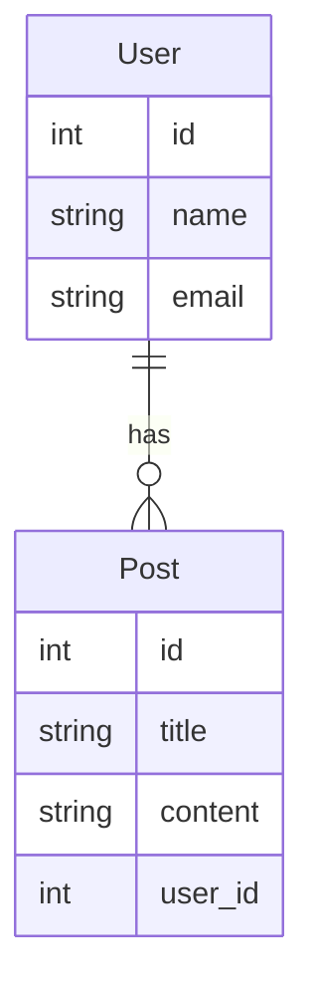

# Project Name

Brief description of the project.

## TODO

- [ ] Update all dependencies using `go get -u ./...`
- [ ] Update README.md, AGENTS.md, SKILLS.md accordingly to your project.
- [ ] Create a CLAUDE.md by symlinking the AGENTS.md `New-Item -ItemType SymbolicLink -Path "C:\Users\user\Desktop\Projects\go-template\CLAUDE.md" -Target "C:\Users\user\Desktop\Projects\go-template\AGENTS.md"`
- [ ] Create a .claude by symlinking the .agents file `New-Item -ItemType SymbolicLink -Path "C:\Users\user\Desktop\Projects\go-template\.claude" -Target "C:\Users\user\Desktop\Projects\go-template\.agents"`


## Instructions

- Make changes to README.md, AGENTS.md, and skills only by hand, do not use any AI tools for this task.

## ERD



### Prerequisites

- Go 1.25.4+
- Docker & Docker Compose

### Run locally

```bash
cp .env.example .env
docker compose -f docker-compose.dev.yaml up --build # For local development with hot-reloading
docker exec -it app-dev sh # To access the container's shell
```